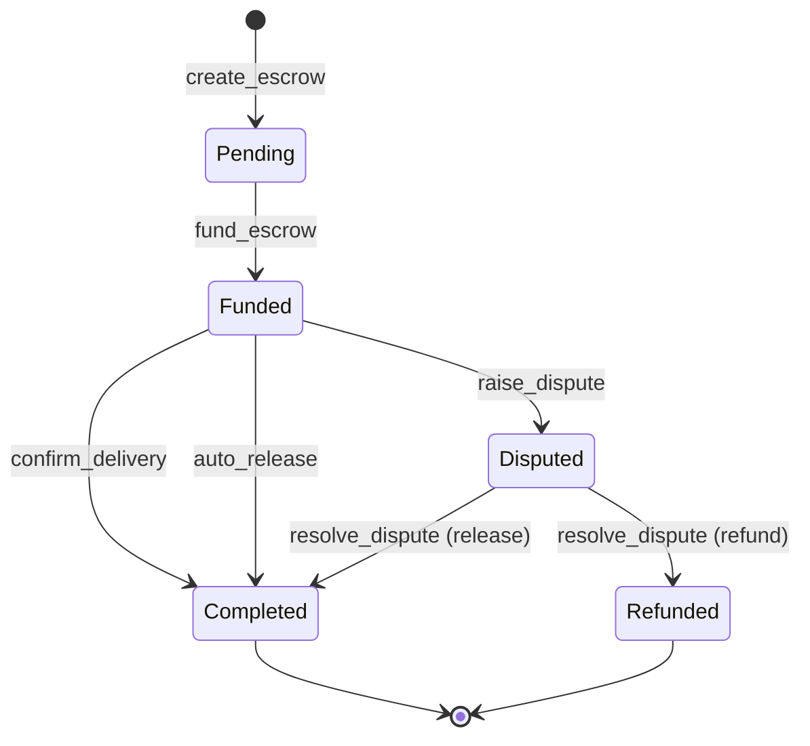
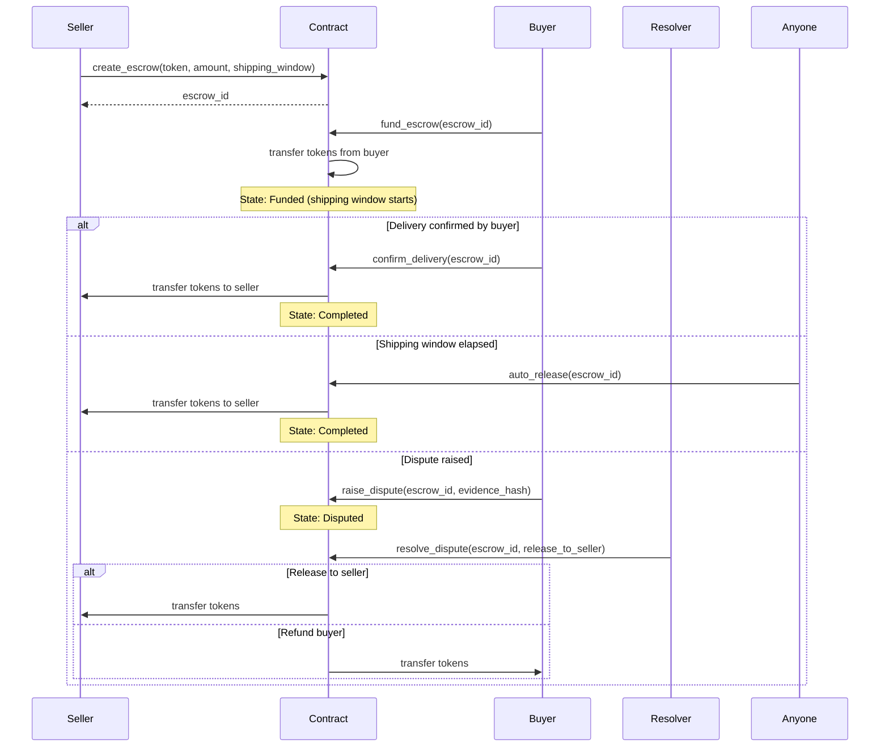
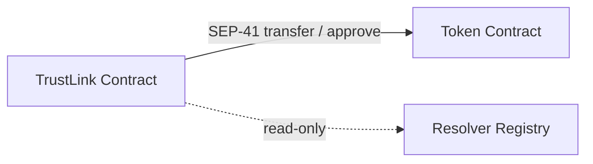

# TrustLink Contract — Architecture

## Overview

TrustLink is a Soroban smart contract on the Stellar network that implements a trustless escrow system between a **buyer** and a **seller**, mediated by an optional **resolver** in case of disputes. All state lives on-chain; no off-chain service is required for core escrow operations.

---

## State Machine



### Valid Transitions

| From | To | Trigger |
|---|---|---|
| `Pending` | `Funded` | `fund_escrow` |
| `Funded` | `Completed` | `confirm_delivery` or `auto_release` |
| `Funded` | `Disputed` | `raise_dispute` |
| `Disputed` | `Completed` | `resolve_dispute(release_to_seller=true)` |
| `Disputed` | `Refunded` | `resolve_dispute(release_to_seller=false)` |

`Completed` and `Refunded` are terminal states — no further transitions are possible.

---

## Escrow Lifecycle Sequence



---

## Token Flow

```mermaid
flowchart LR
    B[Buyer] -->|fund_escrow| C[Contract]
    C -->|confirm_delivery / auto_release| S[Seller]
    C -->|resolve_dispute (refund)| B
    C -->|resolve_dispute (release)| S
```

TrustLink uses the [SEP-41](https://github.com/stellar/stellar-protocol/blob/master/ecosystem/sep-0041.md) token interface (`soroban_sdk::token::Client`). The contract never holds more than one escrow's tokens per escrow ID. Multiple concurrent escrows each lock their own `amount` independently.

---

## Components

### 1. Contract Entry Points (`contracts/escrow/src/lib.rs`)

| Function | Caller | Description |
|---|---|---|
| `create_escrow` | Seller | Creates a new escrow in `Pending` state |
| `fund_escrow` | Buyer | Locks tokens into the contract, moves escrow to `Funded` |
| `confirm_delivery` | Buyer | Releases funds to seller on satisfied delivery |
| `raise_dispute` | Buyer | Moves escrow to `Disputed` with a 32-byte evidence hash |
| `resolve_dispute` | Resolver | Pays out to seller or refunds buyer based on dispute finding |
| `auto_release` | Anyone | Releases to seller once the shipping window has elapsed |
| `record_delivery` | Admin | Records delivery timestamp (idempotent — rejects duplicate calls) |
| `get_escrow` | Anyone | Read-only view of an escrow record |

### 2. Data Types (`EscrowData`)

```
EscrowData {
    seller:          Address        — party receiving funds on success
    buyer:           Option<Address>— set at fund time; None before funding
    resolver:        Address        — trusted third-party mediator
    token:           Address        — SEP-41 token contract address
    amount:          i128           — locked token amount
    shipping_window: u64            — seconds after funding before auto-release is allowed
    funded_at:       u64            — ledger timestamp recorded at fund time
    delivered_at:    Option<u64>    — timestamp when delivery was recorded (None if not yet recorded)
    state:           EscrowState    — current lifecycle state
}
```

---

## Storage Layout

All storage uses Soroban **instance** storage (entries share the contract instance's TTL).

| `DataKey` | Type | Description |
|---|---|---|
| `EscrowCounter` | `u64` | Monotonically increasing counter; also the ID of the most-recently created escrow |
| `Escrow(id: u64)` | `EscrowData` | Full escrow record keyed by its numeric ID |
| `Admin` | `Address` | Contract administrator |
| `FeeCollector` | `Address` | Address receiving platform fees |
| `DefaultFeeBps` | `u32` | Default fee in basis points |
| `Paused` | `bool` | Global pause flag |

IDs start at `1`. The counter is read, incremented, and stored atomically inside `create_escrow`.

---

## Evidence Hash

`raise_dispute` accepts an `evidence_hash: Bytes` parameter that must be **exactly 32 bytes** (a SHA-256 digest of off-chain evidence). The hash is validated before any state change and emitted in the `raise_dispute` event for off-chain indexers.

---

## Events

| Topic | Data | Emitted by |
|---|---|---|
| `("create_escrow",)` | `escrow_id: u64` | `create_escrow` |
| `("fund_escrow",)` | `escrow_id: u64` | `fund_escrow` |
| `("confirm_delivery",)` | `escrow_id: u64` | `confirm_delivery` |
| `("raise_dispute",)` | `(escrow_id: u64, evidence_hash: Bytes)` | `raise_dispute` |
| `("resolve_dispute",)` | `(escrow_id: u64, release_to_seller: bool)` | `resolve_dispute` |
| `("auto_release",)` | `escrow_id: u64` | `auto_release` |
| `("delivery_recorded",)` | `(escrow_id: u64, delivered_at: u64)` | `record_delivery` |
| `("escrow_shipped",)` | `(escrow_id: u64, tracking_id: String)` | `mark_shipped` |

---

## Authorization Model

| Operation | Who must sign |
|---|---|
| `create_escrow` | `seller` |
| `fund_escrow` | `buyer` |
| `confirm_delivery` | `buyer` (retrieved from stored `EscrowData`) |
| `raise_dispute` | `buyer` (retrieved from stored `EscrowData`) |
| `resolve_dispute` | `resolver` (retrieved from stored `EscrowData`) |
| `record_delivery` | `admin` |
| `auto_release` | No auth required — permissionless after window expires |
| `get_escrow` | No auth required — read-only |

---

## Cross-Contract Interactions



TrustLink calls one external contract: the **token contract** at `EscrowData.token`. All token interactions use `soroban_sdk::token::Client`, which conforms to the SEP-41 interface. No other cross-contract calls are made.

---

## Workspace Structure

```
trust-link-contract/
├── Cargo.toml                     — workspace manifest
├── Makefile                       — developer commands
├── ARCHITECTURE.md                — this file
├── README.md
├── bindings/                      — TypeScript bindings
│   ├── package.json
│   └── src/
└── contracts/
    └── escrow/
        ├── Cargo.toml
        ├── fuzz/                  — fuzz testing targets
        ├── tests/                 — integration tests
        └── src/
            ├── lib.rs             — contract implementation
            ├── types.rs           — data types and keys
            ├── errors.rs          — error codes
            ├── events.rs          — event helpers
            ├── storage.rs         — storage helpers
            ├── helpers/           — payout calculations
            └── test*.rs           — unit tests (60+ files)
```
