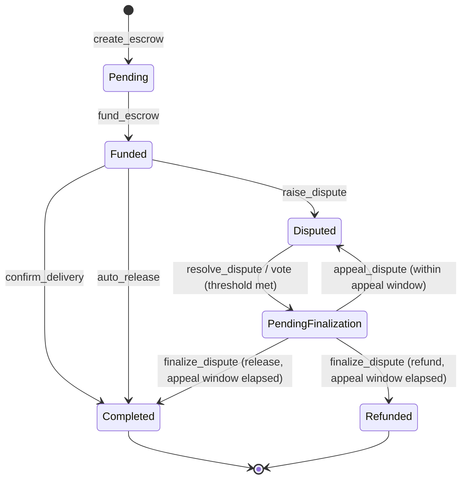
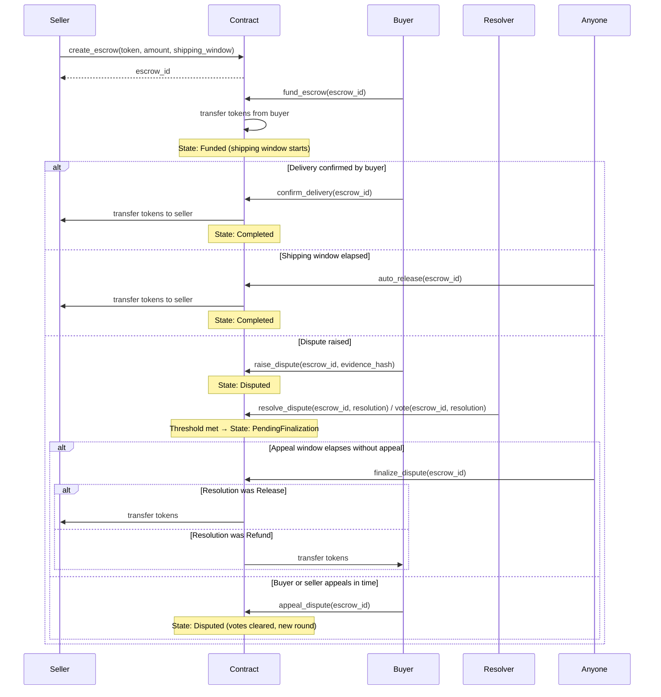
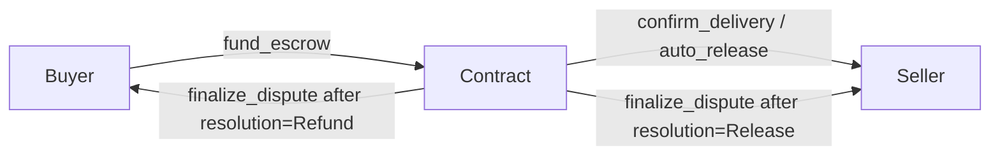
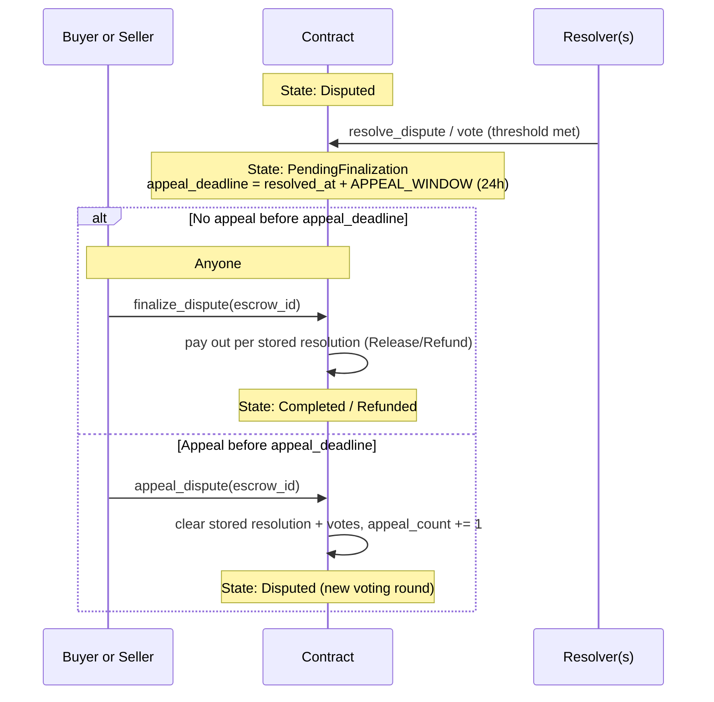
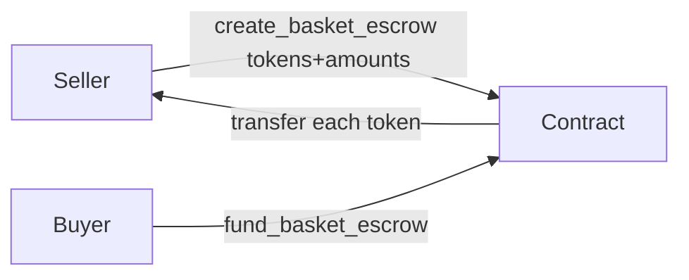
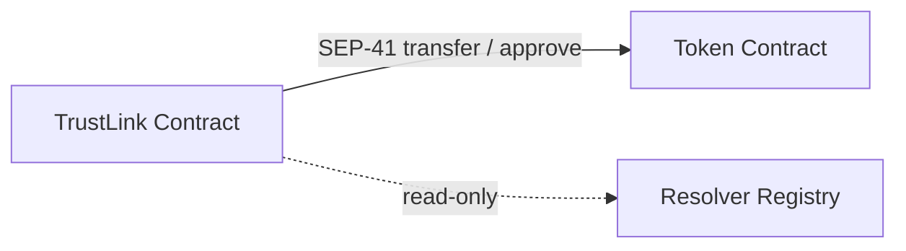

# TrustLink Contract — Architecture

## Overview

TrustLink is a Soroban smart contract on the Stellar network that implements a trustless escrow system between a **buyer** and a **seller**, mediated by an optional **resolver** in case of disputes. All state lives on-chain; no off-chain service is required for core escrow operations.

---

## State Machine



### Valid Transitions

| From | To | Trigger |
|---|---|---|
| `Pending` | `Funded` | `fund_escrow` |
| `Funded` | `Completed` | `confirm_delivery` or `auto_release` |
| `Funded` | `Disputed` | `raise_dispute` |
| `Disputed` | `PendingFinalization` | `resolve_dispute` / `vote` once the resolver threshold is met (see [Multi-Resolver Dispute Resolution](#multi-resolver-dispute-resolution-m-of-n-voting)) |
| `PendingFinalization` | `Completed` | `finalize_dispute`, resolution was `Release`, appeal window elapsed |
| `PendingFinalization` | `Refunded` | `finalize_dispute`, resolution was `Refund`, appeal window elapsed |
| `PendingFinalization` | `Disputed` | `appeal_dispute`, called by buyer or seller before the appeal window elapses (see [Appeal Flow](#appeal-flow)) |

`Completed` and `Refunded` are terminal states — no further transitions are possible. A dispute can be appealed and re-resolved any number of times; each appeal increments `DisputeData.appeal_count` and, for multi-resolver escrows, clears prior votes so a fresh voting round begins.

---

## Escrow Lifecycle Sequence



---

## Token Flow



TrustLink uses the [SEP-41](https://github.com/stellar/stellar-protocol/blob/master/ecosystem/sep-0041.md) token interface (`soroban_sdk::token::Client`). The contract never holds more than one escrow's tokens per escrow ID. Multiple concurrent escrows each lock their own `amount` independently.

---

## Multi-Resolver Dispute Resolution (M-of-N Voting)

An escrow's dispute resolver is not always a single address. `EscrowData.resolvers` holds a `ResolverSet`, which is one of three variants:

| Variant | Created via | Resolver count | Vote threshold |
|---|---|---|---|
| `Single(Address)` | `create_escrow` | 1 | 1 |
| `Multi(MultiResolver { resolvers, threshold })` | `create_escrow_multi` | N (any number) | M (configurable, `0 < M ≤ N`) |
| `Fallback(FallbackResolver { primary, backup, dispute_deadline })` | `create_escrow_with_fallback` | 2 | 1 |

For all three variants, the same entry points are used to resolve a dispute:

- `resolve_dispute(escrow_id, resolution)` or `vote(escrow_id, resolution)` — either name may be used; both call into the same voting logic. The caller must be a member of the escrow's `ResolverSet` (checked via `ResolverSet::contains`).
- Each call records or overwrites that resolver's vote (`ResolverVote { resolver, resolution, voted_at }`) — a resolver changing their mind simply votes again.
- Votes are tallied separately per `ResolutionType` (`Release` vs `Refund`). Once either tally reaches `ResolverSet::threshold()`, the resolution executes automatically in the same transaction and the escrow moves to `PendingFinalization` (see [Appeal Flow](#appeal-flow)) — no separate "finalize the vote" step is needed to reach that state.
- Full vote history for an escrow is queryable via `get_resolver_votes(escrow_id) -> Vec<ResolverVote>`.

For `Single` and `Fallback` sets the threshold is 1, so the first vote from an authorized resolver resolves the dispute immediately. For `Fallback` sets specifically, **both** `primary` and `backup` are authorized to vote at any time — `dispute_deadline` is stored on `FallbackResolver` for off-chain/indexer reference but is not currently read by `contains`/`threshold`, so the contract does not itself gate backup takeover to after that deadline.

Multi-resolver escrows also support an **approved resolver registry**, managed by the admin:

- `add_approved_resolver` / `remove_approved_resolver` — maintain the allowlist.
- `set_resolver_strict(true)` — once enabled, `create_escrow`/`create_escrow_multi`/etc. reject any resolver not in the allowlist.
- `get_approved_resolvers` / `is_resolver_strict` — read-only views.

See [MULTI_RESOLVER_SCHEME.md](./MULTI_RESOLVER_SCHEME.md) for the full design rationale, backward-compatibility notes, and data structures.

---

## Appeal Flow

A resolved dispute is not settled immediately — it passes through a cooling-off period before funds move, so the losing party has a chance to contest the outcome.



Key rules (`finalize_dispute` / `appeal_dispute` in `lib.rs`):

- The appeal window is `APPEAL_WINDOW` (86,400 seconds / 24 hours), measured from `DisputeData.resolved_at`.
- `finalize_dispute` reverts with `AppealWindowActive` if called before `appeal_deadline`. It is permissionless (any caller may trigger it) once the window has elapsed, and pays out the previously-recorded resolution (minus platform and protocol fees) to the seller (`Release`) or buyer (`Refund`).
- `appeal_dispute` reverts with `NotPendingFinalization` if the escrow isn't in `PendingFinalization`, and with `DisputeWindowStillOpen` if called after `appeal_deadline`. Only the escrow's buyer or (first) seller payee may call it.
- A successful appeal clears the stored resolution and, for `Multi` resolver sets, deletes all recorded votes — resolvers must vote again from a clean slate. `DisputeData.appeal_count` is incremented so the number of appeal rounds is queryable via `get_dispute`.
- There is no cap on the number of appeal rounds; the same window and rules apply to every round.

---

## Basket Escrow (Multi-Token Payout)

A basket escrow lets a single escrow lock and later pay out **multiple different tokens** to one seller, instead of the single `(token, amount)` pair used by `create_escrow`.



- `create_basket_escrow(seller, buyer, resolver, tokens, amounts, fee_bps, shipping_window)` — `tokens` and `amounts` must be the same non-empty length. The primary `EscrowData` record (state, resolvers, fee config, lifecycle) tracks `tokens[0]`/`amounts[0]` as usual; the *full* token/amount list is stored separately as `Vec<TokenEntry>` keyed by escrow ID. Every token is checked against the token allowlist (if enabled) before the escrow is created.
- `fund_basket_escrow(escrow_id, buyer)` — transfers **all** basket tokens from the buyer to the contract in one call, in place of calling `fund_escrow` per token.
- `get_basket_tokens(escrow_id) -> Vec<TokenEntry>` — read-only view of the full basket (each `TokenEntry { token, amount }`).
- Payout: every path that releases funds for a basket escrow (`confirm_delivery`, `auto_release`, `co_signed_release`, dispute resolution via `finalize_dispute`) calls the primary token transfer *and* `payout_basket_tokens`, which iterates the stored `TokenEntry` list and transfers each additional token to the recipient. Non-basket escrows have an empty basket list, so `payout_basket_tokens` is a no-op for them — the same code path is safe for both.
- The state machine, dispute flow, and appeal flow described above apply identically to basket escrows; only the token transfer step differs.

---

## Components

### 1. Contract Entry Points (`contracts/escrow/src/lib.rs`)

| Function | Caller | Description |
|---|---|---|
| `create_escrow` | Seller | Creates a new escrow in `Pending` state with a single resolver |
| `create_escrow_multi` | Seller | Creates an escrow with an M-of-N resolver voting set |
| `create_escrow_with_fallback` | Seller | Creates an escrow with a primary + backup resolver |
| `create_basket_escrow` | Seller | Creates a multi-token ("basket") escrow — see [Basket Escrow](#basket-escrow-multi-token-payout) |
| `fund_escrow` | Buyer | Locks tokens into the contract, moves escrow to `Funded` |
| `fund_basket_escrow` | Buyer | Locks all basket tokens into the contract in one call |
| `confirm_delivery` | Buyer | Releases funds to seller on satisfied delivery |
| `raise_dispute` | Buyer | Moves escrow to `Disputed` with a 32-byte evidence hash |
| `resolve_dispute` / `vote` | Resolver (any member of the escrow's `ResolverSet`) | Casts a resolution vote; once the threshold is met, moves to `PendingFinalization` — see [Multi-Resolver Dispute Resolution](#multi-resolver-dispute-resolution-m-of-n-voting) |
| `finalize_dispute` | Anyone (permissionless) | After the appeal window elapses, pays out the recorded resolution — see [Appeal Flow](#appeal-flow) |
| `appeal_dispute` | Buyer or seller | Reopens a `PendingFinalization` dispute back to `Disputed` within the appeal window |
| `get_resolver_votes` | Anyone | Read-only view of an escrow's vote history |
| `get_basket_tokens` | Anyone | Read-only view of a basket escrow's token/amount list |
| `auto_release` | Anyone | Releases to seller once the shipping window has elapsed |
| `record_delivery` | Admin | Records delivery timestamp (idempotent — rejects duplicate calls) |
| `get_escrow` | Anyone | Read-only view of an escrow record |

### 2. Data Types (`EscrowData`)

```
EscrowData {
    payees:           Vec<Payee>      — payout recipients (single seller today; bps must sum to 10_000)
    buyer:            Option<Address> — set at fund time; None before funding
    resolvers:        ResolverSet     — Single / Multi / Fallback — see Multi-Resolver Dispute Resolution
    token:            Address         — SEP-41 token contract address (primary token for basket escrows)
    amount:           i128            — locked token amount (primary amount for basket escrows)
    fee_bps:          u32             — escrow-level fee, in basis points
    resolver_fee_bps: u32             — arbitration fee taken by the resolver on dispute resolution
    shipping_window:  u64             — seconds after funding (or shipping) before auto-release is allowed
    funded_at:        u64             — ledger timestamp recorded at fund time
    dispute_deadline: u64             — ledger timestamp after which a dispute can no longer be raised
    shipped_at:       u64             — ledger timestamp recorded by mark_shipped (0 if not shipped)
    delivered_at:     Option<u64>     — timestamp when delivery was recorded (None if not yet recorded)
    tracking_id:      Option<String>  — optional shipping tracking reference
    state:            EscrowState     — current lifecycle state
    notes:            Option<String>  — optional free-text note set at creation
}
```

Basket token/amount pairs beyond the primary `token`/`amount` are stored separately, keyed by escrow ID, as `Vec<TokenEntry { token, amount }>` — see [Basket Escrow](#basket-escrow-multi-token-payout).

---

## Storage Layout

All storage uses Soroban **instance** storage (entries share the contract instance's TTL).

| `DataKey` | Type | Description |
|---|---|---|
| `EscrowCounter` | `u64` | Monotonically increasing counter; also the ID of the most-recently created escrow |
| `Escrow(id: u64)` | `EscrowData` | Full escrow record keyed by its numeric ID |
| `Admin` | `Address` | Contract administrator |
| `FeeCollector` | `Address` | Address receiving platform fees |
| `DefaultFeeBps` | `u32` | Default fee in basis points |
| `Paused` | `bool` | Global pause flag |

IDs start at `1`. The counter is read, incremented, and stored atomically inside `create_escrow`.

---

## Evidence Hash

`raise_dispute` accepts an `evidence_hash: Bytes` parameter that must be **exactly 32 bytes** (a SHA-256 digest of off-chain evidence). The hash is validated before any state change and emitted in the `raise_dispute` event for off-chain indexers.

---

## Events

| Topic | Data | Emitted by |
|---|---|---|
| `("create_escrow",)` | `escrow_id: u64` | `create_escrow` |
| `("fund_escrow",)` | `escrow_id: u64` | `fund_escrow` |
| `("confirm_delivery",)` | `escrow_id: u64` | `confirm_delivery` |
| `("raise_dispute",)` | `(escrow_id: u64, evidence_hash: Bytes)` | `raise_dispute` |
| `("resolve_dispute",)` | `(escrow_id: u64, release_to_seller: bool)` | `resolve_dispute` |
| `("auto_release",)` | `escrow_id: u64` | `auto_release` |
| `("delivery_recorded",)` | `(escrow_id: u64, delivered_at: u64)` | `record_delivery` |
| `("escrow_shipped",)` | `(escrow_id: u64, tracking_id: String)` | `mark_shipped` |

---

## Authorization Model

| Operation | Who must sign |
|---|---|
| `create_escrow` / `create_escrow_multi` / `create_escrow_with_fallback` / `create_basket_escrow` | `seller` |
| `fund_escrow` / `fund_basket_escrow` | `buyer` |
| `confirm_delivery` | `buyer` (retrieved from stored `EscrowData`) |
| `raise_dispute` | `buyer` (retrieved from stored `EscrowData`) |
| `resolve_dispute` / `vote` | caller must be a member of `EscrowData.resolvers` (any resolver for `Multi`, either address for `Fallback`, the single resolver for `Single`) |
| `finalize_dispute` | No auth restriction beyond signing the transaction — permissionless once the appeal window has elapsed |
| `appeal_dispute` | `buyer` or the first `payees` entry (seller), retrieved from stored `EscrowData` |
| `add_approved_resolver` / `remove_approved_resolver` / `set_resolver_strict` | `admin` |
| `record_delivery` | `admin` |
| `auto_release` | No auth required — permissionless after window expires |
| `get_escrow` / `get_resolver_votes` / `get_basket_tokens` | No auth required — read-only |

---

## Cross-Contract Interactions



TrustLink calls one external contract: the **token contract** at `EscrowData.token`. All token interactions use `soroban_sdk::token::Client`, which conforms to the SEP-41 interface. No other cross-contract calls are made.

---

## Workspace Structure

```
trust-link-contract/
├── Cargo.toml                     — workspace manifest
├── Makefile                       — developer commands
├── ARCHITECTURE.md                — this file
├── README.md
├── bindings/                      — TypeScript bindings
│   ├── package.json
│   └── src/
└── contracts/
    └── escrow/
        ├── Cargo.toml
        ├── fuzz/                  — fuzz testing targets
        ├── tests/                 — integration tests
        └── src/
            ├── lib.rs             — module wiring, re-exports, constants, the `Escrow` contract type
            ├── instructions.rs    — creation/funding/delivery/cancellation/batch entry points
            ├── admin.rs           — pause, fees, upgrades, token allowlist, resolver registry
            ├── disputes.rs        — raise/vote/finalize/appeal entry points
            ├── queries.rs         — read-only views over escrow/fee/contract state
            ├── internal.rs        — shared private helpers (storage, validation, fee math)
            ├── types.rs           — data types and keys
            ├── errors.rs          — error codes
            ├── events.rs          — event helpers
            ├── storage.rs         — storage helpers
            ├── helpers/           — payout calculations
            └── test*.rs           — unit tests (60+ files)
```
