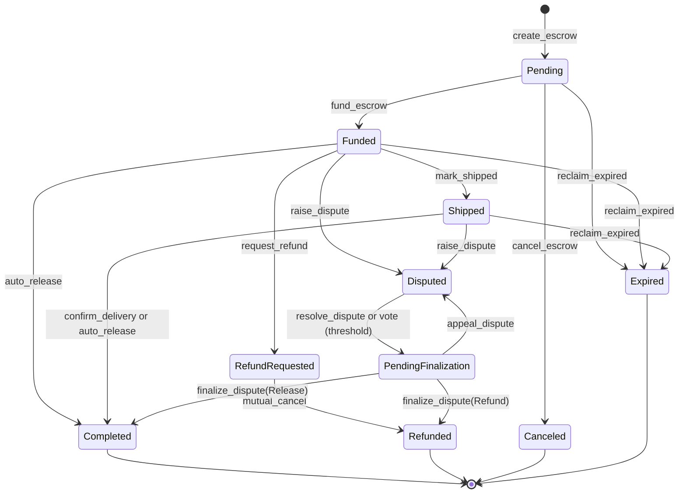

# Escrow State Machine

This document is the formal lifecycle specification for `EscrowState`. The enum
is defined in `contracts/escrow/src/types.rs`.

## States

| State | Meaning | Terminal |
|---|---|---|
| `Pending` | Escrow terms exist, but buyer funds have not been locked. | No |
| `Funded` | Buyer funds are locked in the contract. | No |
| `Shipped` | Seller has marked the escrow shipped and stored a tracking id. | No |
| `RefundRequested` | Buyer requested refund before shipping. | No |
| `Disputed` | Buyer raised a dispute before the dispute deadline. | No |
| `PendingFinalization` | Dispute resolved but awaiting finalization (appeal window). | No |
| `Completed` | Funds were released to the seller. | Yes |
| `Refunded` | Funds were returned to the buyer after dispute resolution. | Yes |
| `Canceled` | Seller canceled an unfunded escrow. | Yes |
| `Expired` | Escrow expired without timely funding or shipping. | Yes |

## Diagram

## Transition Matrix

| Current state | Valid next states | Entrypoint or condition |
|---|---|---|
| `Pending` | `Funded` | Buyer funds the escrow. |
| `Pending` | `Canceled` | Seller cancels before funds are locked. |
| `Pending` | `Expired` | Buyer reclaims after expiration deadline. |
| `Funded` | `Shipped` | Seller calls `mark_shipped`. |
| `Funded` | `RefundRequested` | Buyer requests refund before shipping. |
| `Funded` | `Disputed` | Buyer raises a dispute before `dispute_deadline`. |
| `Funded` | `Completed` | Auto-release conditions pass. |
| `Funded` | `Expired` | Buyer reclaims after expiration deadline. |
| `RefundRequested` | `Refunded` | Seller agrees via `mutual_cancel`. |
| `Shipped` | `Disputed` | Buyer raises a dispute before `dispute_deadline`. |
| `Shipped` | `Completed` | Buyer confirms after the dispute deadline, or auto-release conditions pass. |
| `Shipped` | `Expired` | Buyer reclaims after expiration deadline. |
| `Disputed` | `PendingFinalization` | Resolver calls `resolve_dispute`, or multi-resolver vote reaches threshold. |
| `PendingFinalization` | `Completed` | Caller invokes `finalize_dispute` with Release resolution. |
| `PendingFinalization` | `Refunded` | Caller invokes `finalize_dispute` with Refund resolution. |
| `PendingFinalization` | `Disputed` | Eligible party calls `appeal_dispute`. |
| `Completed` | none | Terminal. |
| `Refunded` | none | Terminal. |
| `Canceled` | none | Terminal. |
| `Expired` | none | Terminal. |

## Guard Conditions

### `Pending -> Funded`

- Buyer must authorize the funding call.
- Escrow must currently be `Pending`.
- Token transfer from buyer to contract must succeed.
- `funded_at` and `dispute_deadline` are set from ledger time.

### `Pending -> Canceled`

- Caller must be the seller.
- Escrow must currently be `Pending`.
- No funds are moved.

### `Funded -> Shipped`

- Caller must be the seller.
- Escrow must currently be `Funded`.
- `tracking_id` must be non-empty and at most `MAX_TRACKING_ID_LEN`.
- `shipped_at` is set from ledger time.

### `Funded -> Disputed` and `Shipped -> Disputed`

- Caller must be the buyer.
- Escrow must currently be `Funded` or `Shipped`.
- Ledger timestamp must be before `dispute_deadline`.
- Dispute evidence hash is stored as `BytesN<32>`.

### `Funded -> Completed` and `Shipped -> Completed`

- `confirm_delivery` requires buyer authorization, the escrow to be `Shipped`,
  and `ledger.timestamp >= dispute_deadline`. Calling it while the dispute
  window is still open returns `DisputeWindowStillOpen`; calling it from
  `Funded` returns `InvalidStateTransition`.
- `auto_release` requires no signer, rejects escrows with an active dispute, and
  requires the configured release windows to have elapsed. It accepts both
  `Funded` (seller never shipped) and `Shipped` escrows.
- Completion transfers the payout to the seller using protocol fee logic.

### `Funded -> RefundRequested`

- Caller must be the buyer.
- Escrow must currently be `Funded`.
- Buyer initiates refund request before seller ships.

### `RefundRequested -> Refunded`

- Requires mutual agreement (seller calls `mutual_cancel`).
- Funds are returned to the buyer.

### `Disputed -> PendingFinalization`

- Resolver calls `resolve_dispute` with a resolution type.
- For multi-resolver setups, automatic transition when vote threshold is reached.
- Resolution is recorded but not immediately executed.
- Enters appeal window.

### `PendingFinalization -> Completed` and `PendingFinalization -> Refunded`

- Caller invokes `finalize_dispute` to execute the recorded resolution.
- `ResolutionType::Release` pays the seller and moves to `Completed`.
- `ResolutionType::Refund` pays the buyer and moves to `Refunded`.
- Arbitration fee is deducted before payout.

### `PendingFinalization -> Disputed`

- Eligible party calls `appeal_dispute` during appeal window.
- Clears the resolution and increments appeal count.
- Returns to `Disputed` state for fresh resolution.

### `Pending/Funded/Shipped -> Expired`

- Buyer calls `reclaim_expired` after expiration deadline has passed.
- Requires `expires_at + grace_period` to have elapsed.
- Returns funds to buyer if escrow was funded.
- No refund for `Pending` escrows (never funded).

### `Disputed -> Completed` and `Disputed -> Refunded`

- Caller must be the escrow resolver or the current admin.
- Escrow must currently be `Disputed`.
- Arbitration fee is deducted before payout.
- `ResolutionType::Release` pays the seller and moves to `Completed`.
- `ResolutionType::Refund` pays the buyer and moves to `Refunded`.

## Invariants

- `Completed`, `Refunded`, `Canceled`, and `Expired` are terminal states.
- Self-transitions are invalid.
- `Pending` escrows cannot be disputed or completed.
- `Canceled` escrows cannot be funded later.
- A dispute must resolve to either seller release or buyer refund.
- `PendingFinalization` represents an approved resolution awaiting execution or appeal.
- Appeals from `PendingFinalization` return to `Disputed` for re-resolution.
- `RefundRequested` requires seller cooperation via `mutual_cancel` to complete.
- `Expired` state is only reachable if expiration schedule was set at creation.
- Resolver rotation is allowed only before a terminal state and does not change
  `EscrowState`.
- `record_delivery` records `delivered_at` for a shipped escrow and does not
  change `EscrowState`.

## Implementation Notes

The pure `transition_state` helper in `contracts/escrow/src/lib.rs` is intended
to centralize lifecycle validity. When entrypoint behavior, tests, or this
document change, update all three in the same PR.

As of the current revision, `events.rs` and tests reference funding and dispute
events, while the checked-in `lib.rs` should be audited to ensure the public
funding and dispute entrypoints remain present and aligned with this formal
state machine.

